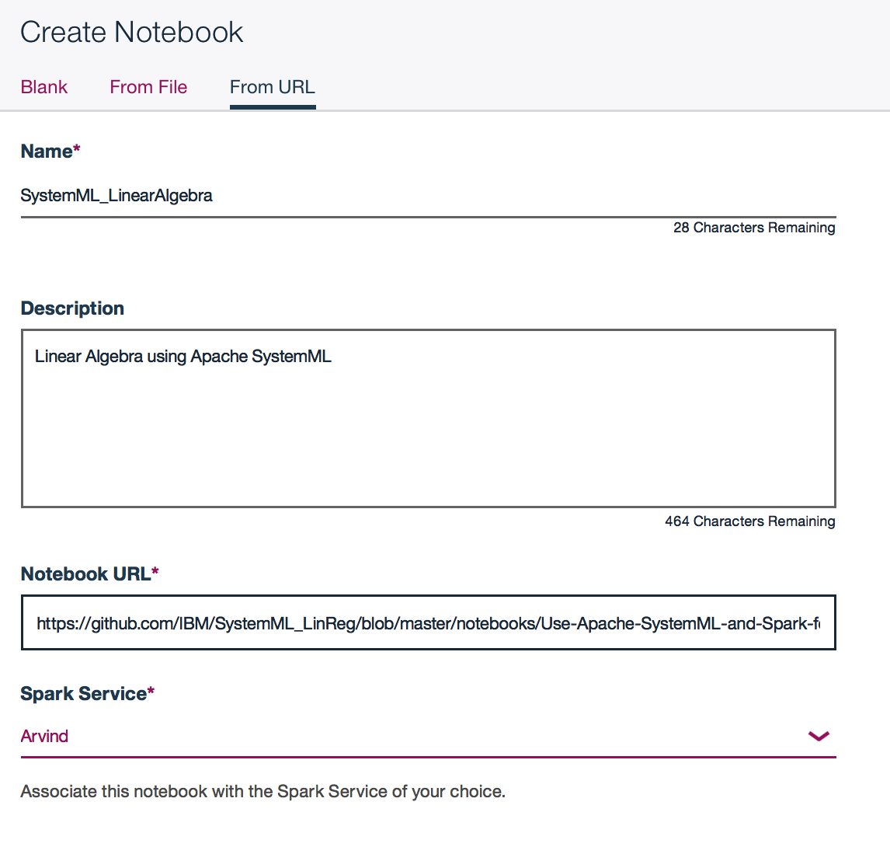

# Machine Learning using an Apache SystemML in the  Data Science Experience (DSX) environment

In this developer journey we will use Apache SystemML running on IBM Data Science Experience (DSX) to do Machine Learning exercise. DSX is an interactive, collaborative, cloud-based environment where data scientists, developers, and others interested in data science can use tools (e.g., RStudio, Jupyter Notebooks, Spark, etc.) to collaborate, share, and gather insight from their data.

When the reader has completed this journey, they will understand how to:

* Use [Jupyter Notebooks](http://jupyter.org/) to load, visualize, and analyze data
* Run Notebooks in [IBM Data Science Experience](https://datascience.ibm.com/)
* Leverage [Apache SystemML](http://systemml.apache.org) as a machine learning library

The intended audience for this journey is application developers and other stakeholders who wish to utilize the power of Data Science quickly and effectively to solve machine learning problem using Apache SystemML. In this case, Linear Regression example provided to demonstrate ease and power of Apache SystemML. There are various out of box algorithms provided by Apache SystemML. User can develop their own algorithms using Apache SystemML's Declarative Machine Language (DML) which has R or Python like syntax or customize any algorithm provided in the package. For more information about additional functionality support, documentation, roadmap please visit [Apache SystemML](http://systemml.apache.org)

# Included Components

* [IBM Data Science Experience](https://www.ibm.com/bs-en/marketplace/data-science-experience): Analyze data using RStudio, Jupyter, and Python in a configured, collaborative environment that includes IBM value-adds, such as managed Spark.
* [Bluemix Spark](https://console.bluemix.net/catalog/services/apache-spark)
* Cloud Object Storage

## Featured technologies

* [Jupyter Notebooks](http://jupyter.org/): An open-source web application that allows you to create and share documents that contain live code, equations, visualizations and explanatory text.

* [Apache SystemML](http://systemml.apache.org) an open source machine learning library. It allows data scientists to express machine learning algorithms through declarative language (DML) using R or Python like syntax.

# Watch the Video

# Steps

Follow these steps to setup and run this developer journey. These steps are
described in detail below.

1. [Sign up for the Data Science Experience](#1-sign-up-for-the-data-science-experience)
2. [Create the notebook](#2-create-the-notebook)
3. [Run the notebook](#3-run-the-notebook)
4. [Save and Share](#4-save-and-share)

## 1. Sign up for the Data Science Experience

Sign up for IBM's [Data Science Experience](http://datascience.ibm.com/). By signing up for the Data Science Experience, two services: ``DSX-Spark`` and ``DSX-ObjectStore`` will be created in your Bluemix account.

If you are already using default services ``DSX-Spark`` and ``DSX-ObjectStore`` for other application, you can create new instance of "Apache Spark" as described below.

How to create ``Apache Spark`` instance:
* Login/Sign up in the [Bluemix](http://bluemix.net)
* Go to ``Dashboard`` using menu located at top left corner.
* Go to ``Data & Analytics`` section.
* Click on ``Apache Spark`` service. Enter service name, e.g. ``DSX-SystemML``.

## 2. Create the notebook

Create the Project:
* From the [IBM Data Science Experience page](https://apsportal.ibm.com/analytics) either click the ``Get Started`` tab at the top or scroll down to ``Recently updated projects``.
* Click on ``+ Create Project`` or ``+ New Project`` under Recently updated projects.
* Choose a ``Name`` and, optionally, a ``Description``. Accept the default ``DSX-Spark`` for Spark Service, ``Object Storage (Swift API)`` for Storage Type, and ``DSX-ObjectStorage`` for Target Object Storage Instance.
* Click ``Create``.

How to create the Notebook:
* In you project, click ``add notebooks``.
* Click the tab for ``From URL`` and enter a ``Name`` and optional ``Description``.
* In the ``Notebook URL`` box put: https://github.com/IBM/SystemML/blob/master/notebooks/Machine-Learning-Using-Apache-SystemML.ipynb
* Enter ``Spark Service`` instance name and click ``Create Notebook``. This name could be ``DSX-Spark`` if you are using default instance comes with DSX account or ``DSX-SystemML`` if you have specified this name while creating new ``Apache Spark`` instance.

## 3. Run the notebook

When a notebook is executed, what is actually happening is that each code cell in
the notebook is executed, in order, from top to bottom.

Each code cell is selectable and is preceded by a tag in the left margin. The tag
format is `In [x]:`. Depending on the state of the notebook, the `x` can be:

* A blank, this indicates that the cell has never been executed.
* A number, this number represents the relative order this code step was executed.
* A `*`, this indicates that the cell is currently executing.

There are several ways to execute the code cells in your notebook:

* One cell at a time.
  * Select the cell, and then press the `Play` button in the toolbar.
* Batch mode, in sequential order.
  * From the `Cell` menu bar, there are several options available. For example, you
    can `Run All` cells in your notebook, or you can `Run All Below`, that will
    start executing from the first cell under the currently selected cell, and then
    continue executing all cells that follow.
* At a scheduled time.
  * Press the `Schedule` button located in the top right section of your notebook
    panel. Here you can schedule your notebook to be executed once at some future
    time, or repeatedly at your specified interval.

## 4. Save and Share

### How to save your work:

Under the `File` menu, there are several ways to save your notebook:

* `Save` will simply save the current state of your notebook, without any version
  information.
* `Save Version` will save your current state of your notebook with a version tag
  that contains a date and time stamp. Up to 10 versions of your notebook can be
  saved, each one retrievable by selecting the `Revert To Version` menu item.

### How to share your work:

You can share your notebook by selecting the “Share” button located in the top
right section of your notebook panel. The end result of this action will be a URL
link that will display a “read-only” version of your notebook. You have several
options to specify exactly what you want shared from your notebook:

* `Only text and output`: will remove all code cells from the notebook view.
* `All content excluding sensitive code cells`:  will remove any code cells
  that contain a *sensitive* tag. For example, `# @hidden_cell` is used to protect
  your dashDB credentials from being shared.
* `All content, including code`: displays the notebook as is.
* A variety of `download as` options are also available in the menu.

# License

[Apache 2.0](LICENSE)
