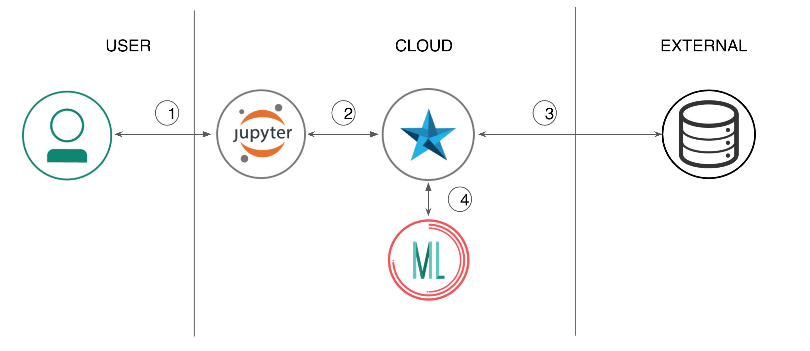
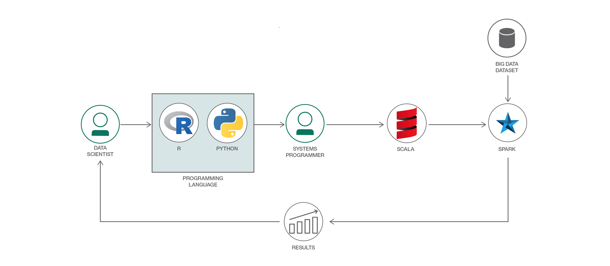
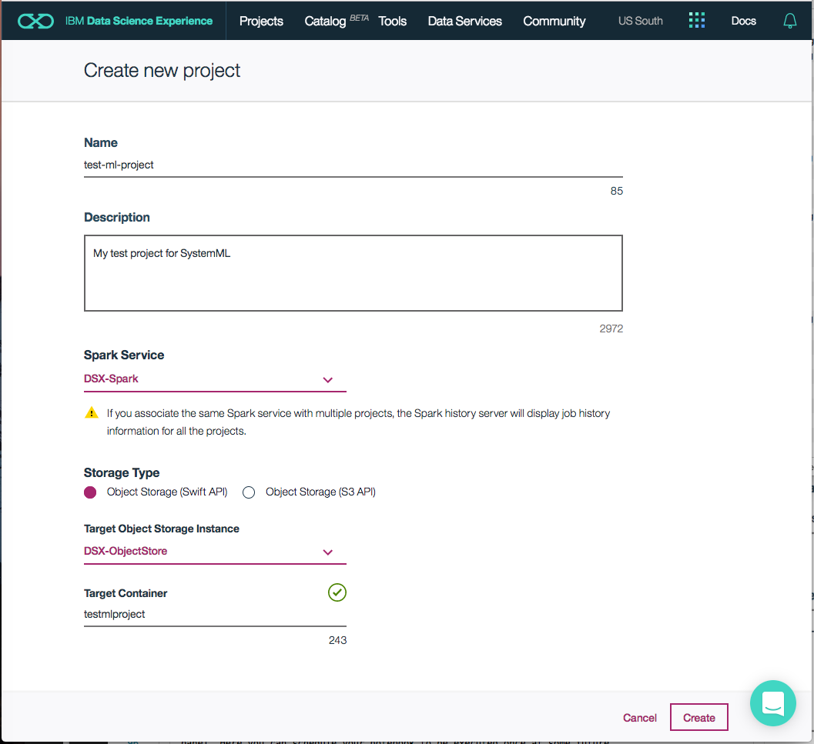
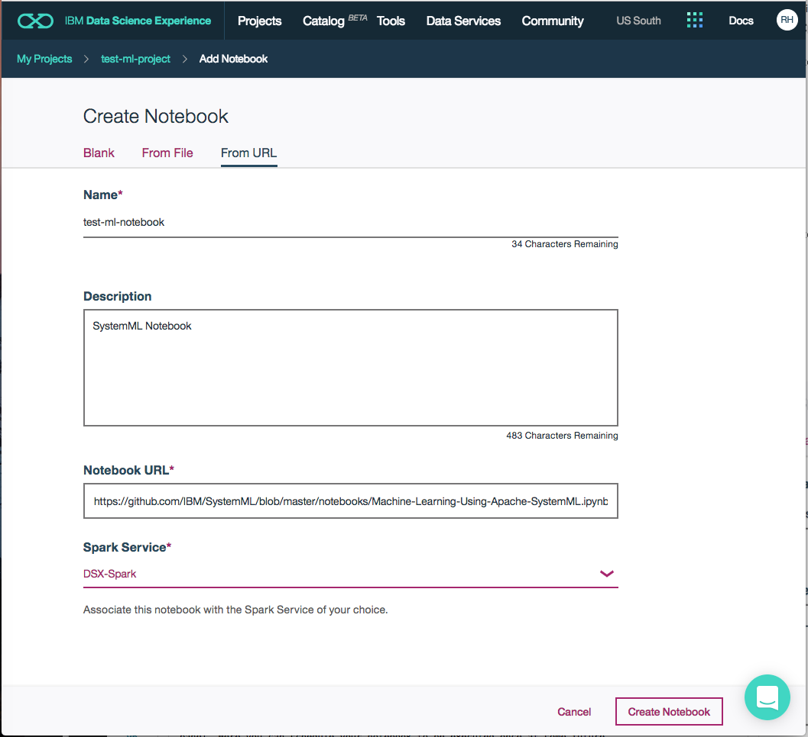

# Using Apache SystemML for Machine Learning in a Watson Studio Notebook

In this Code Pattern we will use Apache SystemML running on IBM Watson Studio to perform a Machine Learning exercise. Watson Studio is an interactive, collaborative, cloud-based environment where data scientists, developers, and others interested in data science can use tools (e.g., RStudio, Jupyter Notebooks, Spark, etc.) to collaborate, share, and gather insight from their data. Apache SystemML is a flexible machine learning platform that is optimized to scale with large data sets.

When you have completed this Code Pattern, you will understand how to:

* Use [Jupyter Notebooks](http://jupyter.org/) to load, visualize, and analyze data
* Run Notebooks in [IBM Watson Studio](https://datascience.ibm.com/)
* Leverage [Apache SystemML](http://systemml.apache.org) as a machine learning library

The intended audience for this Code Pattern is both application developers and other stakeholders who wish to utilize the power of Data Science quickly and effectively to solve machine learning problems using Apache SystemML. Although Apache SystemML provides various out-of-the box algorithms to experiment with, this specific Code Pattern will provide a Linear Regression example to demonstrate the ease and power of Apache SystemML. Additionally, users can develop their own algorithms using Apache SystemML's Declarative Machine Language (DML) which has R or Python like syntax, or customize any algorithm provided in the package. For more information about additional functionality support, documentation, and the roadmap, please visit [Apache SystemML](http://systemml.apache.org).

## Flow

1. Load the provided notebook onto the IBM Watson Studio platform.
2. The notebook interacts with an Apache Spark instance.
3. A sample big data dataset is loaded into the Jupyter Notebook.
4. To perform machine learning, Apache SystemML is used atop Apache Spark.

## Included Components

* [IBM Watson Studio](https://www.ibm.com/bs-en/marketplace/data-science-experience): Analyze data using RStudio, Jupyter, and Python in a configured, collaborative environment that includes IBM value-adds, such as managed Spark.
* [IBM Analytics for Apache Spark](https://console.ng.bluemix.net/catalog/services/apache-spark): An open source cluster computing framework optimized for extremely fast and large scale data processing.

## Featured technologies

* [Jupyter Notebooks](http://jupyter.org/): An open-source web application that allows you to create and share documents that contain live code, equations, visualizations and explanatory text.
* [Apache SystemML](http://systemml.apache.org): An open source machine learning library. It allows data scientists to express machine learning algorithms through declarative language (DML) using R or Python like syntax.

### State of the art

Typically data scientist writes an algorithm on subset of dataset which can be fit on the workstation (laptop) disk/memory. Once he/she is satisfied with the results on a workstation, he/she approach system engineer to implement same algorithm in the distributed environment with much bigger dataset. It may takes weeks if not months to go back and forth between data scientist and system engineer to have equivalent algorithm gets implemented in distributed environment on bigger dataset. As human intervention gets involved there is a potential for introduction of bugs in an implementation of equivalent algorithm. When final algorithm is ready it cannot be determined if final algorithm is equivalent to that of an algorithm which was implemented to run it on a workstation. Its hard to determine if any issues found are due to implementation of algorithm in distributed environment or due to an original algorithm itself.

There comes the “State of the Art” from SystemML. With SystemML data scientist has to write an algorithm only once. With in-built optimizer from SystemML, any algorithm written will have dynamic runtime plan based on data characteristics and runtime environment such as single machine or cluster with multiple nodes. Data Scientist can save lot of time and possible error injection while transforming algorithm implemented to run on single machine to algorithm to be run in a distributed environment.

# Watch the Video

# Steps

Follow these steps to setup and run this Code Pattern. These steps are described in detail below.

1. [Sign up for the Watson Studio](#1-sign-up-for-the-data-science-experience)
2. [Create the notebook](#2-create-the-notebook)
3. [Run the notebook](#3-run-the-notebook)
4. [Save and Share](#4-save-and-share)

## 1. Sign up for the Watson Studio

Sign up for IBM's [Watson Studio](https://dataplatform.ibm.com). By creating a project in Watson Studio a free tier ``Object Storage`` service will be created in your IBM Cloud account. Take note of your service names as you will need to select them in the following steps.

> Note: When creating your Object Storage service, select the ``Free`` storage type in order to avoid having to pay an upgrade fee.

To create these services:
* Login or create your [IBM Cloud](http://bluemix.net) account.
* Create your Spark service by selecting the service type [Apache Spark](https://console.bluemix.net/catalog/services/apache-spark). If the name has not already been used, name your service ``Apache Spark`` so that you can keep track of it.
* Create your Object Storage service by selecting the service type [Cloud Object Storage](https://console.bluemix.net/catalog/infrastructure/object-storage-group). If the name has not already been used, name your service ``Watson Studio-ObjectStorage`` so that you can keep track of it.

> Note: When creating your Object Storage service, select the ``Swift`` storage type in order to avoid having to pay an upgrade fee.

Take note of your service names as you will need to select them in the following steps.

## 2. Create the notebook

First you must create a new Project:
* From the [IBM Watson Studio page](https://apsportal.ibm.com/analytics) either click the ``Get Started`` tab at the top or scroll down to ``Recently updated projects``.
* Click on ``New project`` under ``Recently updated projects``.
* Enter a ``Name`` and optional ``Description``.
* For ``Spark Service``, select your Apache Spark service name.
* For ``Storage Type``, select the ``Object Storage (Swift API)`` option.
* For ``Target Object Storage Instance``, select your Object Storage service name.
* Click ``Create``.

Create the Notebook:
* In [Watson Studio](https://dataplatform.ibm.com), click on `Create notebook` to create a notebook.
* Create a project if necessary, provisioning an object storage service if required.
* In the `Assets` tab, select the `Create notebook` option.
* Select the `From URL` tab.
* Enter a name for the notebook.
* Optionally, enter a description for the notebook.
* For ``Notebook URL`` enter: https://github.com/IBM/SystemML_Usage/blob/master/notebooks/Machine-Learning-Using-Apache-SystemML.ipynb
* Select the free Anaconda runtime.
* Click ``Create Notebook``.

## 3. Run the notebook

When a notebook is executed, what is actually happening is that each code cell in
the notebook is executed, in order, from top to bottom.

Each code cell is selectable and is preceded by a tag in the left margin. The tag
format is `In [x]:`. Depending on the state of the notebook, the `x` can be:

* A blank, which indicates that the cell has never been executed.
* A number, which represents the relative order this code step was executed.
* A `*`, which indicates that the cell is currently executing.

There are several ways to execute the code cells in your notebook:

* One cell at a time.
  * Select the cell, and then press the `Play` button in the toolbar.
* Batch mode, in sequential order.
  * From the `Cell` menu bar, there are several options available. For example, you
    can `Run All` cells in your notebook, or you can `Run All Below`, that will
    start executing from the first cell under the currently selected cell, and then
    continue executing all cells that follow.
* At a scheduled time.
  * Press the `Schedule` button located in the top right section of your notebook
    panel. Here you can schedule your notebook to be executed once at some future
    time, or repeatedly at your specified interval.

## 4. Save and share

### How to save your work:

Under the `File` menu, there are several ways to save your notebook:

* `Save` will simply save the current state of your notebook, without any version
  information.
* `Save Version` will save your current state of your notebook with a version tag
  that contains a date and time stamp. Up to 10 versions of your notebook can be
  saved, each one retrievable by selecting the `Revert To Version` menu item.

### How to share your work:

You can share your notebook by selecting the “Share” button located in the top
right section of your notebook panel. The end result of this action will be a URL
link that will display a “read-only” version of your notebook. You have several
options to specify exactly what you want shared from your notebook:

* `Only text and output`: will remove all code cells from the notebook view.
* `All content excluding sensitive code cells`:  will remove any code cells
  that contain a *sensitive* tag. For example, `# @hidden_cell` is used to protect
  your dashDB credentials from being shared.
* `All content, including code`: displays the notebook as is.
* A variety of `download as` options are also available in the menu.

# Links
* [Demo on Youtube](https://www.youtube.com/watch?v=Jxi7U7VOMYg): Watch the video.
* [What is SystemML](https://www.youtube.com/watch?v=hJfubEYDiQ8&t=428s): A video of a Chicago Spark meetup that outlines Apache SystemML basics.
* [SystemML introduction and demo](http://cleverowl.uk/2016/05/30/systemml-introduction-and-demo): A detailed video introduction to Apache SystemML.
* [Machine Learning Framework survey results](https://www.microway.com/hpc-tech-tips/deep-learning-frameworks-survey-tensorflow-torch-theano-caffe-neon-ibm-machine-learning-stack/): An examination of current major deep learning frameworks, including a comparison of native language of framework, multi-GPU support, and aspects of usability.

# Learn more

* **Data Analytics Code Patterns**: Enjoyed this Code Pattern? Check out our other [Data Analytics Code Patterns](https://developer.ibm.com/code/technologies/data-science/)
* **AI and Data Code Pattern Playlist**: Bookmark our [playlist](https://www.youtube.com/playlist?list=PLzUbsvIyrNfknNewObx5N7uGZ5FKH0Fde) with all of our Code Pattern videos
* **Watson Studio**: Master the art of data science with IBM's [Watson Studio](https://datascience.ibm.com/)
* **Spark on IBM Cloud**: Need a Spark cluster? Create up to 30 Spark executors on IBM Cloud with our [Spark service](https://console.bluemix.net/catalog/services/apache-spark)

# License

[Apache 2.0](LICENSE)
